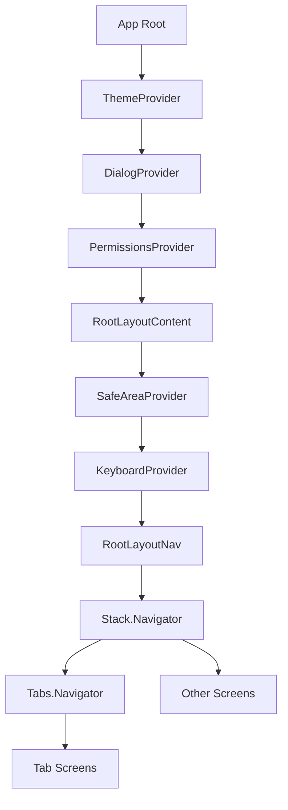

# Deep Linking Configuration Issue Analysis and Solution

## Overview

This document analyzes the deep linking configuration issue in the QTM mobile application, which is built using Expo/React Native. The warning indicates that deep links are configured in multiple places, which can cause conflicts and unpredictable behavior.

## Problem Statement

The warning message indicates:
```
Looks like you have configured linking in multiple places. This is likely an error since deep links should only be handled in one place to avoid conflicts. Make sure that:
- You don't have multiple NavigationContainers in the app each with 'linking' enabled
- Only a single instance of the root component is rendered
- You have set 'android:launchMode=singleTask' in the '<activity />' section of the 'AndroidManifest.xml' file to avoid launching multiple instances
```

## Current Configuration Analysis

### 1. App Configuration (app.json)
The app.json file contains a URL scheme configuration:
```json
{
  "expo": {
    "scheme": "qtm",
    // ... other configurations
  }
}
```

### 2. Navigation Structure
The application uses expo-router with a file-based routing system:
- Root layout: `app/_layout.tsx` (contains main Stack.Navigator)
- Tab layout: `app/(tabs)/_layout.tsx` (contains Tabs.Navigator)
- Auth layout: `app/(auth)/_layout.tsx` (contains Stack.Navigator)

### 3. Dependencies
The project includes `expo-linking` as a dependency, but no explicit linking configuration was found in the navigation containers.

## Solution Design

### 1. Verify Single Navigation Container Pattern
Ensure only one root NavigationContainer exists in the application hierarchy:



### 2. Android Launch Mode Configuration
For Expo managed workflow, configure the android.launchMode in app.json:

```json
{
  "expo": {
    "android": {
      "intentFilters": [
        {
          "action": "VIEW",
          "autoVerify": true,
          "data": [
            {
              "scheme": "qtm"
            }
          ],
          "category": ["BROWSABLE", "DEFAULT"]
        }
      ]
    }
  }
}
```

### 3. Deep Linking Configuration Best Practices
- Remove any duplicate linking configurations
- Centralize linking configuration in the root navigator only
- Ensure proper URL pattern handling

## Implementation Steps

### Step 1: Verify Navigation Structure
1. Confirm that only one Stack.Navigator exists at the root level in `app/_layout.tsx`
2. Ensure Tab.Navigator is nested properly within the Stack.Navigator
3. Check that no additional NavigationContainers exist in other layout files

### Step 2: Configure Android Launch Mode
Add the following configuration to app.json:

```json
{
  "expo": {
    "android": {
      "launchMode": "singleTask"
    }
  }
}
```

### Step 3: Review Deep Linking Usage
1. Check all files that import `expo-linking` for proper usage
2. Ensure linking is only used for opening external URLs, not for internal navigation
3. Verify that expo-router handles all internal navigation

### Step 4: Test Deep Linking
1. Create test deep links using the app scheme
2. Verify that links open the correct screens
3. Confirm that no duplicate instances of the app are created

## Expected Outcomes

After implementing these changes:
- Deep linking will be handled consistently by expo-router
- No conflicts will occur from multiple linking configurations
- Android will properly handle single instance launching
- User experience will be improved with predictable navigation behavior

## Testing Strategy

1. **Unit Testing**: Verify navigation structure components render correctly
2. **Integration Testing**: Test deep link handling with various URL patterns
3. **Platform Testing**: Validate behavior on both iOS and Android
4. **Regression Testing**: Ensure existing navigation functionality remains intact
