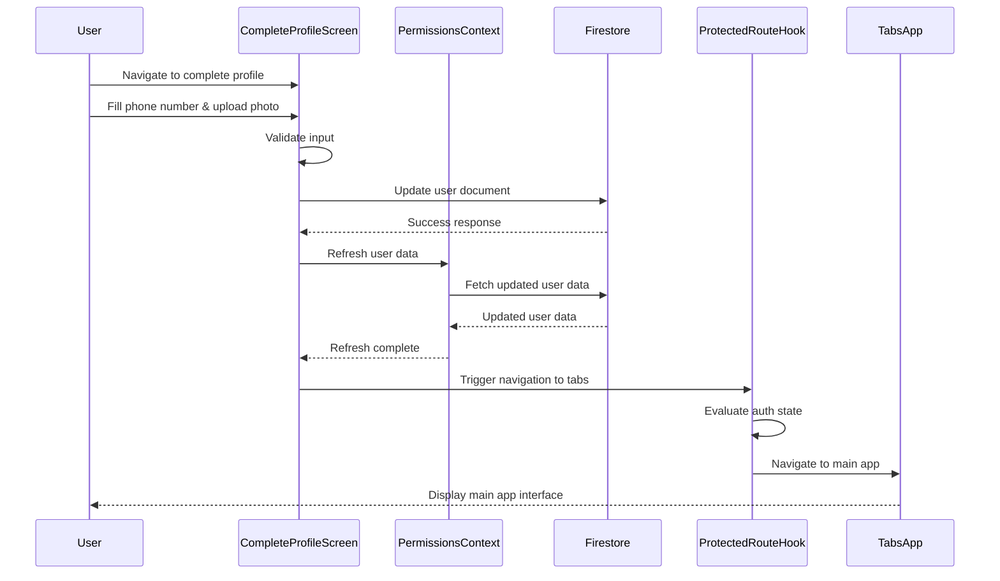

# User Profile Completion Flow Design

## 1. Overview

This document describes the design for fixing the authentication flow issue in the QTM mobile application. The problem occurs when users who don't have a phone number or profile picture are redirected to the complete-profile page, but after saving their information, they encounter an error stating "you have to login first" even though they are already logged in.

## 2. Current Architecture

### 2.1 Authentication Flow
The current authentication system follows this flow:
1. User logs in with email and password (custom backend authentication)
2. User receives a 2FA code for verification
3. Upon successful 2FA verification, Firebase custom token authentication is performed
4. User data is fetched from Firestore to check permissions and profile completeness
5. If profile is incomplete (missing phone or photoURL), user is redirected to complete-profile page

### 2.2 Profile Completion Flow
1. User arrives at complete-profile page if phone or photoURL are missing
2. User fills in phone number and uploads a profile picture
3. On save, the app:
   - Validates phone number format
   - Uploads profile picture to Firebase Storage
   - Updates user document in Firestore
   - Redirects user to main app (tabs)

### 2.3 Issue Identification
The problem occurs in the profile completion flow. After successfully updating the user's profile information in Firestore, the app redirects to the main tabs screen. However, the authentication state may not be properly maintained during this transition, causing the protected route hook to incorrectly interpret the user as unauthenticated.

## 3. Flow Diagram



## 3. Root Cause Analysis

### 3.1 Authentication State Management
The issue stems from how authentication state is managed and synchronized between components:

1. In `complete-profile.tsx`, after updating the user document, the app immediately redirects to `/(tabs)` without ensuring the authentication state is refreshed
2. The `useProtectedRoute` hook checks both `user` and `profile` objects, but there's a timing issue where the profile might be updated in Firestore but not yet reflected in the local state
3. The `PermissionsContext` fetches user data based on the Firebase auth state, but this data isn't refreshed after profile completion

### 3.2 Data Flow Issues
1. Profile data is updated in Firestore but the local `userdoc` state in `PermissionsContext` isn't refreshed
2. The redirect happens before the authentication system can re-evaluate the updated profile state
3. There's no mechanism to notify the authentication system that the profile has been completed

## 4. Proposed Solution

### 4.1 Solution Overview
The solution involves ensuring proper synchronization of authentication state after profile completion by:

1. Refreshing the user permissions and profile data after successful profile update
2. Ensuring the protected route hook properly evaluates the updated profile state
3. Adding proper error handling and user feedback

### 4.2 Detailed Implementation

#### 4.2.1 Modify Complete Profile Screen
Update `app/complete-profile.tsx` to refresh user data after profile completion:

```typescript
// In handleCompleteProfile function, after updating Firestore:
if (userdoc) {
  const userDocRef = db.collection('users').doc(userdoc.id);
  await userDocRef.update(dataToUpdate);
  
  // Refresh user permissions and profile data
  await refreshUser(); // This function exists in PermissionsContext
  
  // Navigate to main app
  router.replace('/(tabs)');
}
```

#### 4.2.2 Enhance Permissions Context
Ensure the `refreshUser` function properly updates all relevant state:

```typescript
// In PermissionsContext.tsx
const refreshUser = async () => {
  await fetchUserPermissionsAndInfo();
};
```

#### 4.2.3 Improve Protected Route Logic
Update the `useProtectedRoute` hook to better handle profile completion transitions:

```typescript
// In useProtectedRoute.ts
useEffect(() => {
  if (!authLoaded) return;

  const inAuthGroup = segments[0] === "(auth)";
  const inCompleteProfile = segments.includes("complete-profile");

  if (user) {
    // If the user is authenticated but the profile is incomplete,
    // redirect them to the complete-profile screen.
    if (profile && (!profile.phone || !profile.photoURL) && !inCompleteProfile) {
      router.replace("/complete-profile");
    } 
    // If the user is authenticated and has completed profile, and is in auth flow,
    // redirect them to the main app (tabs).
    else if (profile && profile.phone && profile.photoURL && inAuthGroup) {
      router.replace("/(tabs)/");
    }
  } else {
    // If the user is not authenticated and is not in the auth flow,
    // redirect them to the login screen.
    if (!inAuthGroup && !inCompleteProfile) {
      router.replace("/login");
    }
  }
}, [user, profile, authLoaded]);
```

## 5. Data Models

### 5.1 User Document Structure
The user document in Firestore contains:
- `uid`: User's Firebase UID
- `email`: User's email address
- `phone`: User's phone number
- `photoURL`: URL to user's profile picture
- `name`: User's display name
- `role`: User's role in the system
- `permissions`: Object containing user permissions

### 5.2 Authentication State
The authentication state consists of:
- `user`: Firebase user object
- `userdoc`: Extended user document from Firestore
- `loading`: Authentication loading state

## 6. Business Logic

### 6.1 Profile Completion Validation
1. Validate phone number format (11 digits, starts with "07")
2. Ensure profile picture is selected
3. Upload profile picture to Firebase Storage
4. Update user document in Firestore
5. Refresh authentication state
6. Redirect to main application

### 6.2 Authentication State Synchronization
1. After profile update, refresh user data from Firestore
2. Update local state with new profile information
3. Re-evaluate protected route conditions
4. Ensure smooth transition to main application

## 7. Error Handling

### 7.1 Profile Update Failures
- Display specific error messages to user
- Preserve form data to prevent re-entry
- Provide retry mechanism

### 7.2 Authentication State Issues
- Implement fallback authentication checks
- Provide clear error messages for auth-related issues
- Log errors for debugging purposes

## 8. Implementation Steps

### 8.1 Update Complete Profile Screen
1. Modify `handleCompleteProfile` function in `app/complete-profile.tsx`
2. Add call to `refreshUser()` after Firestore update
3. Ensure proper error handling

### 8.2 Enhance Protected Route Logic
1. Update `useProtectedRoute.ts` hook
2. Improve condition checking for profile completeness
3. Add proper navigation logic

### 8.3 Testing the Solution
1. Test profile completion flow from login to main app
2. Verify error scenarios and recovery
3. Test edge cases (network failures, invalid data)

## 9. Testing

### 9.1 Unit Tests
1. Test profile validation logic
2. Test Firestore update operations
3. Test authentication state refresh functionality

### 9.2 Integration Tests
1. Test complete profile flow from login to main app
2. Test error scenarios and recovery
3. Test edge cases (network failures, etc.)

### 9.3 User Acceptance Tests
1. Verify profile completion flow works for new users
2. Ensure authenticated users can complete profiles without being redirected to login
3. Confirm proper navigation after profile completion

## 10. Monitoring and Logging

### 10.1 Error Tracking
- Log profile completion failures with detailed error messages
- Track authentication state issues
- Monitor navigation errors

### 10.2 Performance Metrics
- Profile completion success rate
- Average time to complete profile
- Authentication state refresh performance

### 10.3 User Experience Monitoring
- Track user drop-off points in profile completion flow
- Monitor error message displays
- Collect user feedback on the process